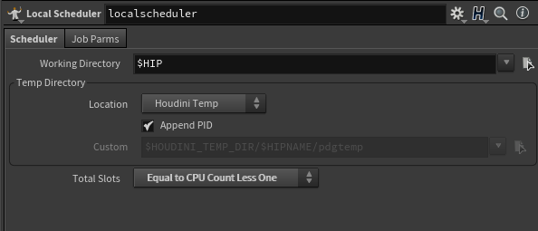

# Tops For Beginners

## Tips

### Not as many work item running at a time as expected? 
This is likely because you need to change the settings for your local scheduler. The default value for the total slots available to your scheduler is `Equal to 1/4 of Total CPU Count`, which for people without a lot of CPU cores available to them will massively limit the capacity of your TOPS processes. I would recommend setting this value to instead be `Equal CPU Count Less One`.

